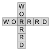

---
output:
  github_document
---

<!-- README.md is generated from README.Rmd. Please edit that file -->

# worrrd 

```{r, echo = FALSE}
knitr::opts_chunk$set(
  collapse = TRUE,
  comment = "#>",
  fig.path = "man/figures/README-"
)
```

## Overview

Build word games using R.  Ya hearrrd?

Features:

  - Crossword Puzzle
  - Wordsearch
  
## Installation

```{r eval = FALSE}
# install.packages("devtools")
devtools::install_github("anthonypileggi/worrrd")
```

## Wordsearch

Create your very own custom wordsearch!  Worrrd.

```{r wordsearch-easy}
library(worrrd)

# Simple wordsearch
words <- c("alligator", "crocodile", "squirrel", "swordfish", "german shepherd", "panda", "wolf")
x <- wordsearch(words, r = 20, c = 20)
plot(x, solution = TRUE)
```

You can make it as hard as you want.  Go bananas!

```{r wordsearch-hard}
# All 50 States
library(datasets)
x <- wordsearch(state.name, r = 50, c = 50)
plot(x, solution = TRUE, puzzle_size = 2, legend_size = 2)
```

### Puzzle Book

If you want to make a pdf book full of wordsearch puzzles that is easily printed, you can provide a .yml file.

**my_book.yaml**
```{yaml eval = FALSE}
title: I made a wordsearch!
author: Unicorn Cupcake
type: wordsearch
rows: 20
cols: 20
pages:
  - name: Fruity Fun
    words: [apple, orange, banana, grapes, kiwi, strawberry, watermelon, lemon, lime]
  - name: Animal Mayhem
    words: [dog, cat, fish, wolf, horse, shark, crocodile, alligator, iguana]
    image: "https://us.123rf.com/450wm/miceking/miceking1506/miceking150601500/40903456-stock-vector-lion-silhouette.jpg"

  - name: Searchin in the USA
    words: "`state.name`"
```

Then you can generate a pdf puzzle book.
```{r, eval = FALSE}
book(input_file = "my_book.yaml", output_file = "my_puzzle_book")
```

## Crossword Puzzle

Oh, you're one of the more sophisticated types that craves a crossword puzzle?  Worrrd.

```{r}
words <- row.names(state.x77)
clues <- paste0(state.region, " state covering ", scales::comma(state.x77[, "Area"]), " square miles.")
x <- crossword(words, clues, r = 40, c = 40)
x
```

```{r crossword}
plot(x)
plot(x, solution = TRUE)
```

## Future Plans

- Allow crossword in the puzzle book

## Known Issues

- Will not work with duplicate words