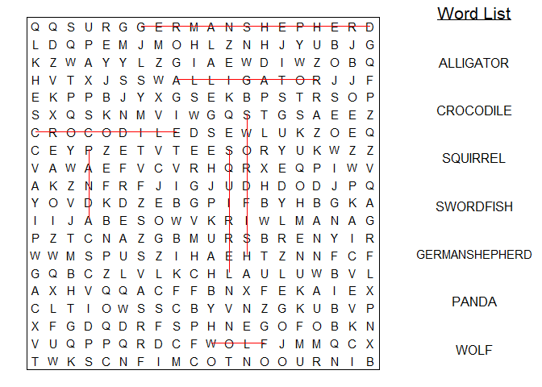
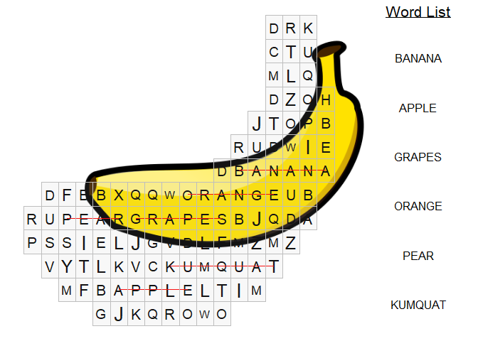

-   [Worrrd](#worrrd)
    -   [Install worrrd](#install-worrrd)
    -   [Wordsearch](#wordsearch)
    -   [Crossword Puzzle](#crossword-puzzle)

<!-- README.md is generated from README.Rmd. Please edit that file -->

------------------------------------------------------------------------

Worrrd
------

Build word games using R. Ya hearrrd?

Features:

-   Crossword Puzzle
-   Wordsearch

### Install worrrd

``` r
install.packages("devtools")
devtools::install_github("anthonypileggi/worrrd")
```

### Wordsearch

Create your very own custom wordsearch! Worrrd.

``` r
library(gamer)

# Simple word search
words <- c("alligator", "crocodile", "squirrel", "swordfish", "german shepherd", "panda", "wolf")
x <- wordsearch(words, r = 20, c = 20)
#> Found positions for 7/7 words.
plot(x, solution = TRUE)
#> Loading required package: ggplot2
#> Warning: package 'bindrcpp' was built under R version 3.4.4
```



You can make it as hard as you want. Go bananas!

``` r
# All 50 States
library(datasets)
x <- wordsearch(state.name, r = 50, c = 50)
#> Found positions for 50/50 words.
plot(x, solution = TRUE, letter_size = 2)
```


#### Custom Shapes

Wait, what? You want to make it in the shape of a banana? I mean, that's kinda weird... but why not!

``` r
banana <- "https://upload.wikimedia.org/wikipedia/commons/9/96/Tux_Paint_banana.svg"
words <- c("banana", "apple", "grapes", "orange", "pear", "kumquat")
x <- wordsearch(words, r = 20, c = 20, image = banana)
#> Warning in req$status: partial match of 'status' to 'status_code'
#> Found positions for 6/6 words.
plot(x, solution = TRUE)
```



### Crossword Puzzle

Oh, you're one of the more sophicated types that craves a crossword puzzle? Worrrd.

``` r
words <- row.names(state.x77)
clues <- paste0(state.region, "ern state covering ", scales::comma(state.x77[, "Area"]), " square miles.")
x <- crossword(words, clues, r = 40, c = 40)
#> Found positions for 50/50 words.
x
#> Crossword Puzzle
#> Contains 50 clues.
#> There are 24 across and 26 down.
```

``` r
plot(x, solution = TRUE)
```


